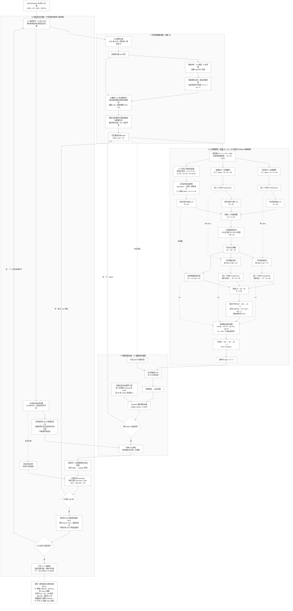

# V7 完整 Mermaid 流程图

统一使用黑白灰样式，以分区标题说明继承部分和 V7 新增策略。实线表示主流程，虚线表示补充的数据或标签连接。

## 阅读说明

- 这是单折训练的完整展开；外层为 5 个种子、9 折 LOSO，共 45 次独立模型训练。B 表示当前批次样本数。
- 目标评估节点复用图中同一三视图网络，不是新增另一个网络。在线 EA 使用当前及此前目标样本的信号统计，不使用目标标签。
- 源扰动在每折数据加载时生成一次，之后重复使用，不是每个 epoch 重新生成。
- 反馈门使用 sigmoid；最终三视图融合门使用竞争 Softmax。V7 没有增加频率 token 细化、源验证选轮或类别条件对齐损失。
- 当前代码每轮计算目标 ACC，但不以此反向传播、调学习率或选择检查点；最终报告第 100 轮结果。反复根据同一目标集结果挑选版本仍可能产生实验选择偏差。
- 结果中的标准差为五个种子各自九受试者平均 ACC 的总体标准差，不是 45 项 ACC 的标准差。

## 代码依据

- [训练入口与学习率策略](../DBConformer_LOSO.py)
- [三视图前向过程](../models/TriViewDBConformer.py)
- [Softmax 加权拼接](../models/TriViewConcatDBConformer.py)
- [源受试者风格扰动](../utils/vision_dg_preprocess.py)
- [EA、数据加载与目标在线评估数据](../utils/utils.py)

图依据本地代码静态核对；Mermaid 源码已检查节点和连接引用，未使用外部渲染器验证排版。
