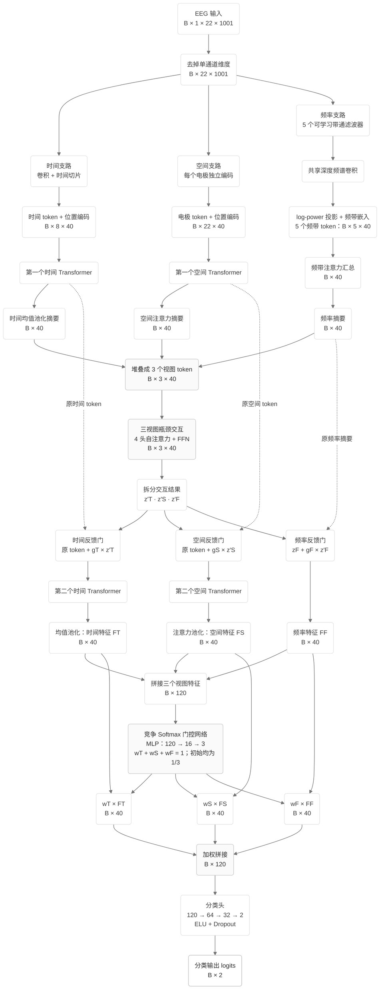

# V7 模型内部结构

仅展示模型前向计算，统一黑白灰样式；不包含 EA、源数据扰动、优化器、训练循环或结果统计。

V7 的模型内部结构与 V5 一致，保留竞争 Softmax 加权拼接。反馈门 gT、gS、gF 使用 sigmoid，初始值为 0.05；末端融合权重使用 Softmax，初始值各为 1/3。频率分支只做摘要级反馈，不包含 V4 的频率 token 细化。

已按当前代码静态核对；未用外部 Mermaid 渲染器验证排版。

